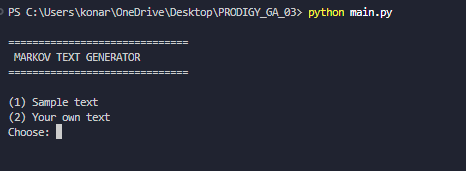
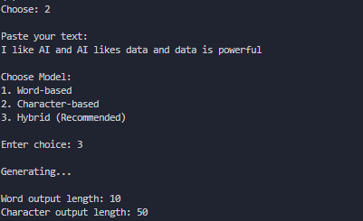
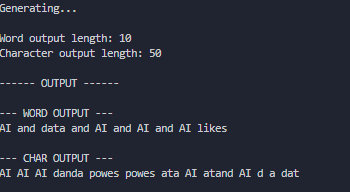

# 🚀 Hybrid Markov Chain Text Generator

A simple yet powerful text generation project using **Markov Chains**.

It generates new text by learning patterns from input data using both **word-level** and **character-level** models.

---

## 🧠 About the Project

This project implements a **statistical text generation model** based on Markov Chains.

It predicts the next word or character based on probability distributions learned from training text.

It demonstrates how simple probabilistic models can be used for basic Natural Language Generation.

---

## ⚙️ Features

✔ Word-based Markov Chain model
✔ Character-based Markov Chain model
✔ Hybrid generation (Word + Character)
✔ Interactive command-line interface (CLI)
✔ Custom user input or sample dataset support
✔ Randomized text generation
✔ Simple and beginner-friendly implementation

---

## 📁 Project Structure

```text
PRODIGY_GA_03/
│
├── screenshots/
│   ├── program_run.png
│   ├── user_input.png
│   └── output.png
│
├── main.py
├── markov.py
├── sample.txt
├── requirements.txt
├── .gitignore
└── README.md
```

---

## ▶️ How to Run

### 1️⃣ Clone the Repository

```bash
git clone https://github.com/tanishaa109/PRODIGY_GA_03.git
```

### 2️⃣ Navigate to the Project Directory

```bash
cd PRODIGY_GA_03
```

### 3️⃣ Run the Program

```bash
python main.py
```

---

## 💻 How It Works

1. User selects:

   * Sample text OR custom input

2. Model trains on the provided text

3. User chooses a generation mode:

   * Word-based
   * Character-based
   * Hybrid

4. The system generates new text using learned probability patterns

---

## 📌 Example

### Input

```text
I like AI and AI likes data and data is powerful
```

### Word Model Output

```text
I like AI likes data is powerful
```

### Character Model Output

```text
Artificial intelligence is transforming data systems
```

### Hybrid Output

```text
--- WORD OUTPUT ---
I like AI likes data is powerful

--- CHAR OUTPUT ---
Artificial intelligence is transforming data systems
```

---

## 📸 Screenshots

### Program Start



### User Input



### Generated Output



---

## 🧪 Technologies Used

* Python
* Markov Chains
* Random Module
* Collections (defaultdict)

---

## 🎯 Learning Outcomes

* Understanding Markov Chains
* Probability-based text generation
* Basic Natural Language Processing (NLP)
* Text generation using statistical models
* Python project development

---

## 🚀 Future Improvements

* Better grammar handling
* Sentence boundary detection
* Larger datasets for training
* Streamlit Web Interface
* Advanced language generation techniques

---

## 👨‍💻 Author

**Tanisha Sharma**

Built as part of the **Prodigy InfoTech Generative AI Internship Program** to explore probabilistic text generation techniques using Markov Chains.

---

## 📜 License

This project is open-source and free to use for educational purposes.
